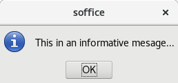
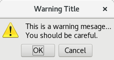
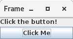
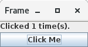

= GUNO Extension Documentation
:author: Carl Marcum
:email: carl.marcum@codebuilders.net
:toc: left

== Introduction
*UNO* stands for *Universal Network Objects* and is the base component technology for **Apache OpenOffice**.

*GUNO* stands for *Groovy UNO* and is an *Apache Groovy* language extension of the **Java UNO API's**. The artifact of this extension is a Java jar file that when used in a Groovy script or class adds convenience methods to the regular Java UNO API's.

*The goal of the Groovy UNO Extension is to allow UNO programming that is less verbose than using the Java UNO API's alone.*

These methods are implemented using **Groovy Extension Modules**. An extension module allows you to **add new methods to existing classes**, including classes which are precompiled, like classes from the JDK or in this case Java UNO classes. These new methods, unlike those defined through a metaclass or using a category, are available globally.

Aside from a few general methods, initial efforts have been on enhancing the spreadsheet API's and future work will be on enhancing the other applications.

This guide is not intended to be an OpenOffice UNO tutorial but is for developers familiar with the concepts to showcase the advantages of Apache Groovy + GUNO Extension for UNO programming.

This documentation's AsciiDoc source is maintained in the docs folder of the https://github.com/cbmarcum/guno-extension[GUNO-Extension Project] on GitHub.

== Extension Explanation
The term Extension is used in multiple contexts in this document and can cause some confusion. This https://github.com/cbmarcum/guno-extension[GUNO-Extension] project is compiled as a Jar file and is a Groovy Extension module that extends (adds methods to) other precompiled Java UNO library API jars when used with the Groovy programming language.

The https://github.com/cbmarcum/openoffice-groovy[OpenOffice-Groovy] extension is an OpenOffice application extension packaged as an OXT file and installed into OpenOffice using the OpenOffice Extension Manager. OpenOffice extensions add functionality to OpenOffice.

Another OpenOffice application extension project is https://github.com/cbmarcum/openoffice-groovy-macros[OpenOffice-Groovy-Macros] that recreate many of the sample macros included with OpenOffice using the Groovy language.

== Getting the Extension
Projects that build using dependencies from artifact repositories like Apache Maven, JCenter, etc. just need to include
the latest version as a dependency in the build file or POM.

=== Gradle Projects
[source, gradle]
----
compile group: 'net.codebuilders', name: 'guno-extension', version: '4.1.6.13'
----

=== Maven Projects
[source, xml]
----
<dependency>
    <groupId>net.codebuilders</groupId>
    <artifactId>guno-extension</artifactId>
    <version>4.1.6.13</version>
</dependency>
----

=== Groovy Scripts 
Groovy scripts can declare a Grab dependency at the beginning before import statements.
[source, groovy]
----
@Grapes(
    @Grab(group='net.codebuilders', module='guno-extension', version='4.1.6.13')
)
----

=== OpenOffice Macros 
OpenOffice doesn't support Groovy macros by default. A companion project https://github.com/cbmarcum/openoffice-groovy[OpenOffice-Groovy] is an OpenOffice Extension that adds Groovy as a macro language using the OpenOffice Scripting Framework. + 
Macros written in Groovy do not need to include a guno-extension dependency as the guno-extension jar file is packaged with the openoffice-groovy extension. 

The OpenOffice-Groovy extension is not required to use Groovy for standalone client applications or OpenOffice Extensions. It is only required for AOO macros written in Groovy.

== Groovy Syntax
There are many advantages to using the Groovy language over pure Java and most can be found in the
http://groovy-lang.org/documentation.html[Apache Groovy documentation].

=== Casting
While Java requires us to cast an Object to a type like when using the queryInterface
method, Groovy does the casting automatically. We also don't need line-ending semicolons.

.Java
[source, java]
----
XIndexAccess xIndexSheets = (XIndexAccess) UnoRuntime.queryInterface(XIndexAccess.class, xSheets);
----
.Groovy
[source, groovy]
----
XIndexAccess xIndexSheets = UnoRuntime.queryInterface(XIndexAccess.class, xSheets)
----

=== Static and Dynamic Types
While Groovy works great as a dynamic language where we can declare variables with the `def` keyword, I prefer to declare
types most of the time. This is only my preference and not a requirement.

=== Property Access
When Object properties have getter and setter methods to use, Groovy allows what appears to be property access while actually
using the get and set methods.

.Java
[source,java]
----
XSpreadsheets xSheets = myDoc.getSheets();
----
.Groovy
[source,groovy]
----
XSpreadsheets xSheets = myDoc.sheets
----

=== String Interpolation
Groovy has a feature called http://groovy-lang.org/syntax.html#_string_interpolation[String Interpolation] where a variable is replaced with it's string value upon evaluation of the string by enclosing the variable as shown.

.Java
[source,java]
----
String str = "My String";
println("This is " + str);
----

.Groovy
[source,groovy]
----
String str = "My String"
println "This is ${str}"
----
Both output `This is My String`

.Macro Development Tip
[NOTE]
====
If you start OpenOffice from the command line you can see stdout and stderr message output when using `println()` statements.
====

== Using the Extension
The best way to explain the differences between the Java UNO API's and using Groovy with and without the extension is with some example code. Many of the examples are spreadsheet examples are from SCalc.java that is included with the AOO SDK.

=== Import Statement
To use the UnoExtension you need to add to your imports section.

.Add the UnoExtension to imports
[source, groovy]
----
import org.openoffice.guno.UnoExtension
----

=== Get an XComponentLoader
One of the first objects we need in AOO development  after we bootstrap the office and acquire an XComponentContext is an
XComponentLoader we can use to load a document. This requires a few steps as shown:

.Groovy (begins with a XComponentContext _xComponentContext_ reference)
[source,groovy]
----
XMultiComponentFactory mxRemoteServiceManager = null
    XComponentLoader aLoader = null
    mxRemoteServiceManager = xComponentContext.getServiceManager()
    aLoader = UnoRuntime.queryInterface(
        XComponentLoader.class, mxRemoteServiceManager.createInstanceWithContext(
        "com.sun.star.frame.Desktop", self))
----

The GUNO Extension adds a convenience method to XComponentContext + 
`XComponentLoader getComponentLoader()` to return an XComponentLoader object.

.GUNO Extension
[source,groovy]
----
XComponentLoader aLoader = xComponentContext.componentLoader
----

=== UnoRuntime.queryInterface
A common task in OpenOffice development with Java is using the static `UnoRuntime.queryInterface()` method to get an
Interface reference from another within the same Service object. The UNO concepts of Services and Intefaces are beyond
the scope of this guide, but you can get more information in the https://wiki.openoffice.org/wiki/Documentation/DevGuide[AOO Development Guide].

The `UnoRuntime.queryInterface(ReturnObject.class, FromObject)` method can be replaced with the new `FromObject.guno(ReturnObject.class)` method.

.Java (begins with a XSpreadsheetDocument _myDoc_ reference)
[source,java]
----
XSpreadsheets xSheets = myDoc.getSheets();
XIndexAccess xIndexSheets = (XIndexAccess) UnoRuntime.queryInterface(XIndexAccess.class, xSheets);
xSheet = (XSpreadsheet) UnoRuntime.queryInterface(XSpreadsheet.class, xIndexSheets.getByIndex(0));
----

.GUNO Extension
[source,java]
----
XSpreadsheets xSheets = myDoc.sheets
XIndexAccess xIndexSheets = xSheets.guno(XIndexAccess.class)
xSheet = xIndexSheets.getByIndex(0).guno(XSpreadsheet.class)
----

=== Property Access
An UNO object must offer its properties through interfaces that allow you to work with properties. The most basic form
of these interfaces is the interface com.sun.star.beans.XPropertySet .

In XPropertySet, two methods carry out the property access: 
`Object getPropertyValue(String propertyName)` and 
`void setPropertyValue(String propertyName, Object propertyValue)`. 

The GUNO Extension adds two special methods to XPropertySet: `Object getAt(String propertyName)` and `void putAt(String propertyName, Object propertyValue)`.

Example: Set the CellStyle of a spreadsheet Cell `xCell`.

.Java
[source,java]
----
XPropertySet xCellProps = (XPropertySet)UnoRuntime.queryInterface(XPropertySet.class, xCell);
xCellProps.setPropertyValue("CellStyle", "Result");
----

.GUNO Extension
[source,groovy]
----
XPropertySet xCellProps = xCell.guno(XPropertySet.class)
xCellProps.putAt("CellStyle", "Result")
----

These special methods allow a shorthand version to `getAt()` and `putAt()` using http://groovy-lang.org/operators.html#subscript-operator[Groovy Subscript Operator] notation. This can Get or Set properties depending on which side of the assigment it's on.

.GUNO Extension using the Subscript operator for assignment.
[source,groovy]
----
xCellProps["CellStyle"] = "Result"
----

See below for an even faster method to set Cell Properties.

=== Spreadsheet By Index and Name
The GUNO Extension adds a method to XSpreadsheetDocument that returns the XSpreadsheet by the index position saving the steps of getting the XIndexAccess enumeration of sheets and then getting the sheet by index. Likewise there is a method that uses the sheet name to get the sheet. `XSpreadsheet getSheetByIndex(Integer nIndex)` and 
`XSpreadsheet getSheetByName(String name)`.

The example leaves out the try/catch for brevity and assumes we have a reference to XSpreadsheetDocument `myDoc`

.Java
[source,java]
----
XSpreadsheets xSheets = myDoc.getSheets();
XIndexAccess xIndexSheets = (XIndexAccess) UnoRuntime.queryInterface(XIndexAccess.class, xSheets);
xSheet = (XSpreadsheet) UnoRuntime.queryInterface(XSpreadsheet.class, xIndexSheets.getByIndex(0));
----

.GUNO Extension
[source,groovy]
----
XSpreadsheet xSheet = myDoc.getSheetByIndex(0)
----

From this point on, the examples are Groovy without and then with the GUNO Extension.

=== Index Access
The GUNO Extension adds a special `getAt(int index)` method to XIndexAccess that allows the Groovy Subscript operator to be used.

This first example will ignore that we already have a method to get a sheet by index from a spreadsheet document to highlight the the Subscript operator with XIndexAccess `xIndexAccess[0]` instead of `xIndexAccess.getByIndex(0)`.

Example: Set the active sheet.

.With Extension (begin with an XSpreadsheetDocument xSpreadsheetDocument reference)
----
XSpreadsheets xSheets = xSpreadsheetDocument.sheets
XIndexAccess xIndexAccess = xSheets.guno(XIndexAccess.class)
xSheet = xIndexAccess[0].guno(XSpreadsheet.class)
XController xController = xModel.currentController
XSpreadsheetView xSpreadsheetView = xController.guno(XSpreadsheetView.class)
xSpreadsheetView.activeSheet = xSheet
----

.GUNO Extension (shorter version)
----
xSheet = xSpreadsheetDocument.getSheetByIndex(0)
XController xController = xModel.currentController
XSpreadsheetView xSpreadsheetView = xController.guno(XSpreadsheetView.class)
xSpreadsheetView.activeSheet = xSheet
----

=== Cell Contents
The GUNO Extension adds getters and setters for cell Formulas (text) and Values (numeric) to XCellRange. This allows you to get or set the contents of a cell by it's position in a XCellRange, XSheetCellRange, or XSpreadsheet depending on which Interface  you use. +
The methods are: +
`String getFormulaOfCell(int column, int row)` + 
`void setFormulaOfCell(int column, int row, String value)` +
`Double getValueOfCell(int column, int row)` + 
`void setValueOfCell(int column, int row, float value)`

.Without Extension (begins with an XSpreadsheet _xSpreadsheet_ reference)
[source, groovy]
----
XCellRange xCellRange = UnoRuntime.queryInterface(XCellRange.class, xSpreadsheet)
xCell = xCellRange.getCellByPosition(2,2)
XText xCellText = UnoRuntime.queryInterface(XText.class, xCell)
xCellText.setString("Quotation")
----

.With Extension
[source, groovy]
----
xSpreadsheet.setFormulaOfCell(2,2, "Quotation")
----

=== Cell Address
A CellAddress object allows access to the column and row address of a cell. Normally you need to get a XCellAddressable object using an XCell reference to get a CellAddress object. + 
The GUNO Extension adds a _CellAddress getAddress()_ method to XCell to get the address directly.

Example: Get the address of a cell and print it.

.Without Extension (begins with an XCell _xCell_ reference)
[source,groovy]
----
XCellAddressable xCellAddressable = UnoRuntime.queryInterface(XCellAddressable.class, xCell)
CellAddress cellAddress = xCellAddressable.getCellAddress()
println("Cell Address: column ${cellAddress.Column}, row ${cellAddress.Row}")
----

.With Extension
[source,groovy]
----
CellAddress cellAddress = xCell.address
println("Cell Address: column ${cellAddress.Column}, row ${cellAddress.Row}")
----

=== Cell Style
The extension adds getter and setter methods for CellStyle to XCell: + 
`Object getCellStyle()` and `void setCellStyle(Object value)` allowing what looks like property access to the CellStyle property.

Example: Set the cell style to "Result":

.Without Extension
[source,java]
----
XPropertySet xCellProps = UnoRuntime.queryInterface(XPropertySet.class, xCell)
xCellProps.setPropertyValue("CellStyle", "Result")
----

.With extension
[source,java]
----
xCell.cellStyle = "Result"
----

Example: Get the style as a String:

.With Extension
[source, groovy]
----
String style = xCell.cellStyle
----

=== CellVertJustify Enum
The extension adds getter and setter methods to XCell allowing what looks like property access to vertJustify and use the https://www.openoffice.org/api/docs/common/ref//com/sun/star/table/CellVertJustify.html[CellVertJustify] enum types. + 
`Integer getVertJustify()` and `void setVertJustify(Object value)`.

.Without Extension
[source,groovy]
----
xCellProps.setPropertyValue("VertJustify", com.sun.star.table.CellVertJustify.TOP)
----

.With Extension
[source,groovy]
----
xCell.vertJustify = com.sun.star.table.CellVertJustify.TOP
----

=== Cell Ranges
The GUNO Extension adds a method to XSpreadsheet to get the the cell ranges that match certain types.: + 
`XSheetCellRanges getCellRanges(Object type)` where type is one or a combination of  http://www.openoffice.org/api/docs/common/ref/com/sun/star/sheet/CellFlags.html[CellFlag constants] added together.

.Without Extension
[source,groovy]
----
XCellRangesQuery xCellQuery = UnoRuntime.queryInterface(XCellRangesQuery.class, xSpreadsheet)
XSheetCellRanges xFormulaCells = xCellQuery.queryContentCells((short)CellFlags.FORMULA)
----

.With Extension
[source,groovy]
----
XSheetCellRanges xFormulaCells = xSpreadsheet.getCellRanges(CellFlags.FORMULA)
----

=== Cell Iteration
Normally we start with a Cell Range and get an XEnumerationAccess, and from that an XEnumeration and use it iterate through Cells. + 

.Without Extension
[source,groovy]
----
XEnumerationAccess xFormulas = xFormulaCells.getCells()
XEnumeration xFormulaEnum = xFormulas.createEnumeration()
while (xFormulaEnum.hasMoreElements()) {
    Object formulaCell = xFormulaEnum.nextElement()
    xCell = UnoRuntime.queryInterface(XCell.class, formulaCell)
    XCellAddressable xCellAddress = UnoRuntime.queryInterface(XCellAddressable.class, xCell)
    println("Formula cell in column " +
        xCellAddress.getCellAddress().Column + ", row " + xCellAddress.getCellAddress().Row
        + " contains " + xCell.getFormula())
}
----

The GUNO Extension adds a `List<XCell> getCellList()` method to both XSheetCellRanges and XSheetCellRangeContainer to get a List of cells to iterate over.

Using the List we can iterate through each cell in a http://groovy-lang.org/closures.html[Groovy Closure].

.With Extension  
[source,groovy]
----
XCell[] cellList = xFormulaCells.cellList
cellList.each() { cell -> 
    println("Formula cell in column ${cell.address.Column}, " + 
    "row ${cell.address.Row} contains ${cell.formula}")
}
----

=== RangeContainer
Range Containers hold Cell Ranges. XSheetRangeContainer provides methods to access cell ranges in a collection via index and to add and remove cell ranges.

Example: Create a new cell range container, add all cells that are filled, and iterate through them. + 
XCellRangesQuery `queryContentCells()` takes a short but CellFlags are a long (1023 is the total of all CellFlag constants)

.Without Extension (begins with an XSpreadsheet xSpreadsheet reference)
[source,groovy]
----
XCellRangesQuery xCellQuery = UnoRuntime.queryInterface(XCellRangesQuery.class, xSpreadsheet)
XSheetCellRanges xCellRanges = xCellQuery.queryContentCells((short) 1023)
com.sun.star.lang.XMultiServiceFactory xDocFactory = UnoRuntime.queryInterface(com.sun.star.lang.XMultiServiceFactory.class, xSpreadsheetDocument)
com.sun.star.sheet.XSheetCellRangeContainer xRangeCont = UnoRuntime.queryInterface(com.sun.star.sheet.XSheetCellRangeContainer.class,
    xDocFactory.createInstance("com.sun.star.sheet.SheetCellRanges"))
xRangeCont.addRangeAddresses(xCellRanges.rangeAddresses, false)
println("All filled cells: ")
com.sun.star.container.XEnumerationAccess xCellsEA = xRangeCont.getCells()
com.sun.star.container.XEnumeration xEnum = xCellsEA.createEnumeration()          
while (xEnum.hasMoreElements()) {
    Object aCellObj = xEnum.nextElement()
    xCell = UnoRuntime.queryInterface(XCell.class, aCellObj);
    com.sun.star.sheet.XCellAddressable xAddr = UnoRuntime.queryInterface(com.sun.star.sheet.XCellAddressable.class, aCellObj)
    com.sun.star.table.CellAddress cellAddress = xAddr.getCellAddress()
    println("Formula cell in column ${cellAddress.Column}, row ${cellAddress.Row} contains ${xCell.formula}")
}
----

The GUNO Extension adds a `XSheetCellRangeContainer getRangeContainer()` method to XSpreadsheetDocument that returns an XSheetRangeContainer. 

.With Extension and using a Closure to iterate over
[source,groovy]
----
XSheetCellRangeContainer xRangeCont = xSpreadsheetDocument.rangeContainer
XSheetCellRanges xCellRanges = xSpreadsheet.getCellRanges(1023)
xRangeCont.addRangeAddresses(xCellRanges.rangeAddresses, false)
XCell[] cellList = xRangeCont.cellList
println("All filled cells: ")
cellList.each() { cell -> 
    println("Formula cell in column ${cell.address.Column}, row ${cell.address.Row} contains ${cell.formula}")
}
----

== Graphical User Interfaces
=== Message Box
UNO provides a XMessageBox to display UI messages to the user. There a a number of steps to get from an XComponentContext to displaying a message.

There are standard  https://www.openoffice.org/api/docs/common/ref/com/sun/star/awt/MessageBoxType.html[MessageBoxType enums] used depending on the icon and https://www.openoffice.org/api/docs/common/ref/com/sun/star/awt/MessageBoxButtons.html[MessageBoxButton constants] for button combinations displayed. the INFOBOX type is different in that it will ignore the button parameter and use BUTTONS_OK and display a single OK button.

.Without Extension (begins with an XcomponentContext xContext reference)
[source,groovy]
----
XMultiComponentFactory xMCF = xContext.getServiceManager()
XDesktop xDesktop = xMCF.createInstanceWithContext("com.sun.star.frame.Desktop", xContext)
XFrame xFrame = xDesktop.getCurrentFrame()
Object oToolkit = xMCF.createInstanceWithContext("com.sun.star.awt.Toolkit", xContext)
XMessageBoxFactory xMessageBoxFactory = UnoRuntime.queryInterface(XMessageBoxFactory.class, oToolkit)
XWindow xWindow = xFrame.getContainerWindow()
XWindowPeer xWindowPeer = UnoRuntime.queryInterface(XWindowPeer.class, xWindow)

XMessageBox xMessageBox = xMessageBoxFactory.createMessageBox(xWindowPeer,
    MessageBoxType.INFOBOX, MessageBoxButtons.BUTTONS_OK,
    "Window Title", "This in an informative mesage...")

short infoBoxResult = xMessageBox.execute()
----

The GUNO extension adds two methods to XComponentContext that return a XMessageBox: + 
`XMessageBox getMessageBox(MessageBoxType type, Integer buttons, String message)` that uses a default window title of "soffice" and + 
`XMessageBox getMessageBox(MessageBoxType type, Integer buttons, String message, String title)` that includes a title parameter.

.With Extension (Info Box example using default title)
[source,groovy]
----
XMessageBox infoBox = xContext.getMessageBox(MessageBoxType.INFOBOX, 
    MessageBoxButtons.BUTTONS_OK, "This in an informative mesage...")

short infoBoxResult = infoBox.execute()
----
.Info Box

.With Extension (Warning Box example with title and default okay button and a cancel button)
[source,groovy]
----
String warnMsg = "This is a warning mesage...\nYou should be careful."
Integer warnButtons = MessageBoxButtons.BUTTONS_OK_CANCEL +  MessageBoxButtons.DEFAULT_BUTTON_OK
XMessageBox warningBox = xContext.getMessageBox(MessageBoxType.WARNINGBOX, 
    warnButtons, warnMsg, "Warning Title")
    
short warnBoxResult = warningBox.execute()
----
.Warning Box

=== Groovy SwingBuilder
If you're a Java developer you've probaly heard of Swing with was Java's 2nd generation UI Toolkit. Many developers have ran into threading issues leading to blocked and unresponsive UI's if Swing wasn't used correctly.

Groovy includes many examples of what they call Builders which are examples of a Domain Specific Language (DSL) focused on hierarchal structures. Builders are great for declaring content like HTML, XML, and in this case Swing. An added bonus is it takes care of handling the threading for you.

This simple example comes straight from the http://groovy-lang.org/swing.html[Groovy Swing] page. I modified the size dimension of the frame and added the return Integer at the end. Otherwise it runs as a AOO marco.

.Simple SwingBuilder Example
[source,groovy]
----
import groovy.swing.SwingBuilder
import java.awt.BorderLayout as BL

count = 0
new SwingBuilder().edt {
  frame(title: 'Frame', size: [150, 80], show: true) {
    borderLayout()
    textlabel = label(text: 'Click the button!', constraints: BL.NORTH)
    button(text:'Click Me',
         actionPerformed: {count++; textlabel.text = "Clicked ${count} time(s)."; println "clicked"}, constraints:BL.SOUTH)
  }
}

// Groovy OpenOffice scripts should always return 0
return 0
----
.After launch
 
.After first button click

